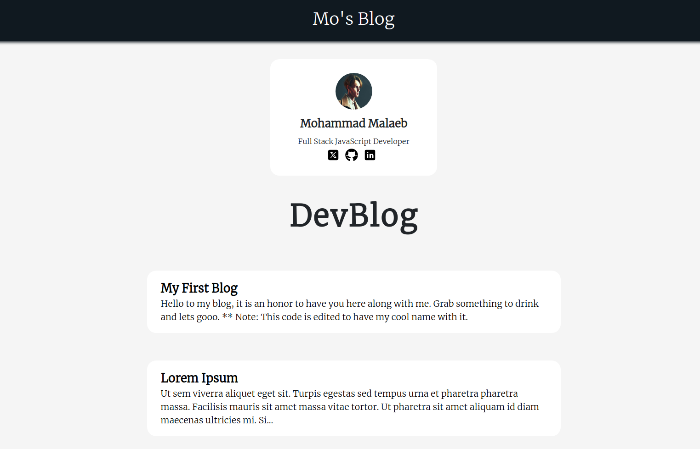
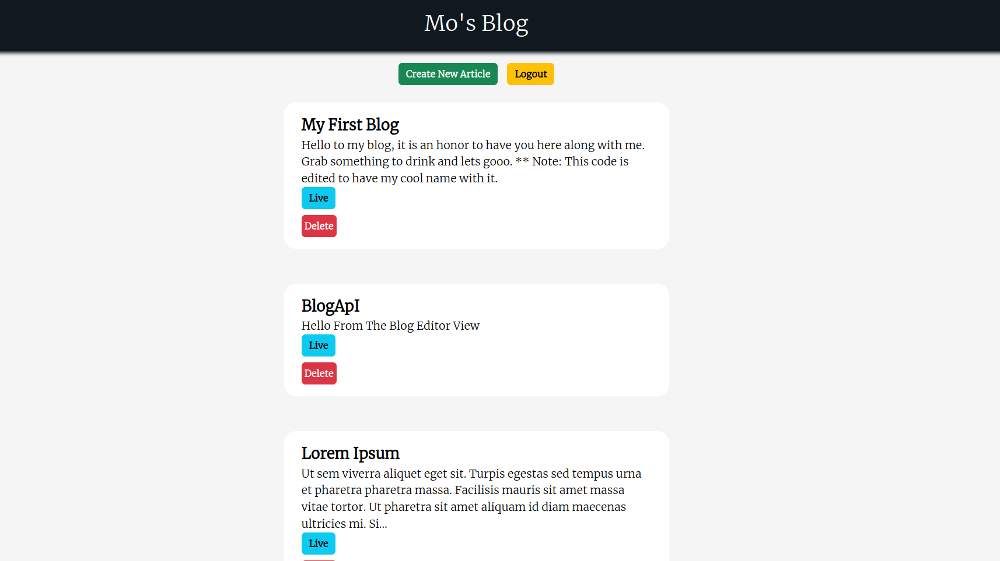
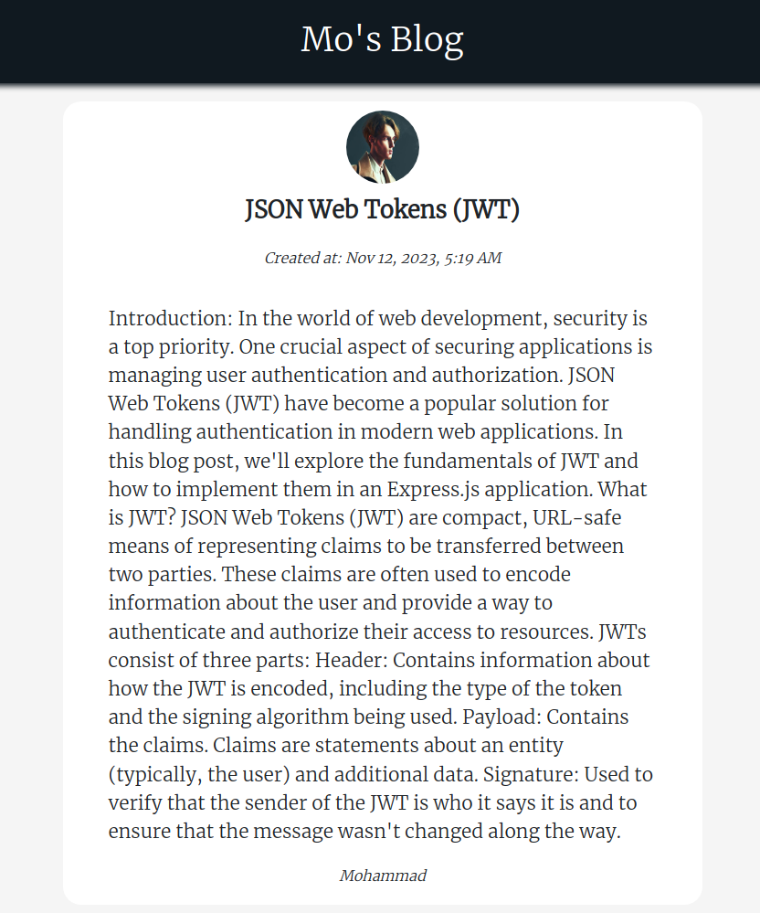

# Blog API Project

## Overview

This is a full stack Blog project built using Node.js, Express, and MongoDB to create a RESTful API. Additionally, two frontend interfaces have been implemented using React: one for normal readers (without registration capabilities) and another for editors.

For The Editor Interface Code [See](https://github.com/Mo-21/Blog-Editor).




## Table of Contents

- [Features](#features)
- [Prerequisites](#prerequisites)
- [Installation](#installation)
- [Configuration](#configuration)
- [API Endpoints](#api-endpoints)
- [License](#license)

## Features

- Register and login to start editing.
- Create, Read, and Delete blog posts.
- User authentication and authorization for editors using bcrypt and JSON Web Token.
- Two React frontend interfaces: one for normal readers and one for editors.
- The registration process currently requires special key.

## Prerequisites

Make sure you have the following installed:

- Node.js and npm
- MongoDB

## Installation

1. Clone the repository:

   ```bash
   git clone https://github.com/your-username/blog-api.git

   ```

2. Navigate to the project directory:

   ```bash
   cd Blog-API/server

   ```

3. Install dependencies:

   ```bash
   npm install
   ```

## Configuration

1. Create a .env file in the project root with the following variables:

   ```bash
   PORT=3000
   MONGODB_URI=your-mongodb-link
   SECRET_KEY=your-secret-key

   ```

2. Start the project:

   ```bash
   npm run serverstart
   ```

## API Endpoints

1. `GET /api/posts`: Get all blog posts
2. `GET /api/posts/:id`: Get a specific blog post
3. `POST /api/dashboard/create`: Create a new blog post (requires authentication)
4. `PUT /api/dashboard/:postId/edit: Update a blog post` (requires authentication)
5. `DELETE /api/dashboard/:postId/delete`: Delete a blog post (requires authentication)

## License

This project is licensed under the MIT License.
